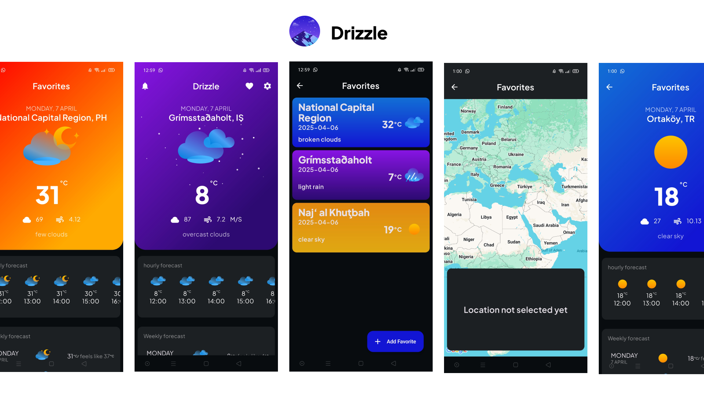

# 🌦️ Weather Forecast Android Application

A modern Android mobile application that provides accurate and real-time weather information based on your current location or any custom-selected city from a map. Users can also set custom weather alerts and save favorite locations.

## 📱 ScreenShot

## 📱 Features

- 🌍 Get weather data for current location using GPS or by selecting on the map
- 🔎 Search for cities using autocomplete
- ❤️ Add and manage favorite locations
- 📆 View hourly and 5-day weather forecasts
- 🌧️ Set alerts for rain, snow, wind, fog, or extreme temperatures
- 🛠️ Customize units (temperature, wind speed), language (English / Arabic)
- 🔔 Alerts can be silent notifications or system alarm sounds

## 🖼️ Screens Overview

### 1. **Home Screen**
- Displays current temperature, time, date, weather icon and description
- Shows humidity, pressure, wind speed, clouds, and more
- Hourly and daily (5-day) forecasts

### 2. **Settings Screen**
- Select GPS or map location
- Choose temperature (Kelvin, Celsius, Fahrenheit)
- Choose wind speed (m/s, mph)
- Language: English or Arabic

### 3. **Weather Alerts Screen**
- Add alerts with:
  - Start and end time
  - Notification type (silent or alarm)
  - Dismiss options

### 4. **Favorites Screen**
- List of saved cities
- Add a new location via map or search
- Remove locations from favorites

## 🧰 Tech Stack

- Kotlin
- MVVM Architecture
- Retrofit (networking)
- Room (local database)
- Coroutines
- WorkManager
- LiveData & ViewModel
- Google Maps SDK
- OpenWeatherMap API

## 🌐 API

- [OpenWeatherMap 5 Day / 3 Hour Forecast API](https://api.openweathermap.org/data/2.5/forecast)

## 📹 Demo

▶️ [https://drive.google.com/file/d/1f5zE1gK9OxHXLqsQIvQqPFL7wBxj5gC6/view?usp=sharing](https://drive.google.com/file/d/1Elf7CsYmH2exktfOscOXMxd3LsnsjfdJ/view?usp=drive_link)
